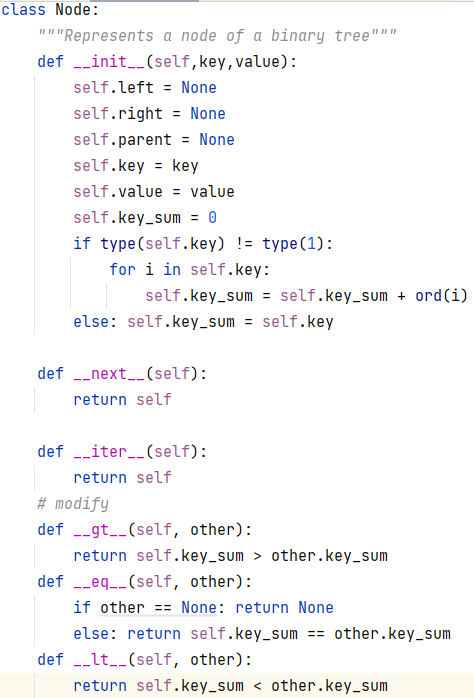
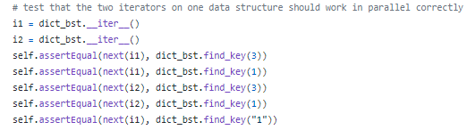
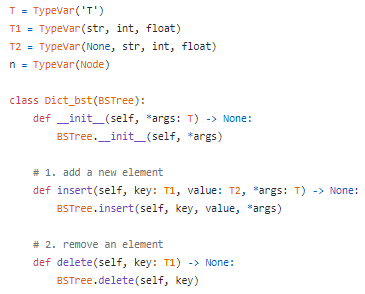

# CPO-vegetable

## Basic Information
> - ### title:  
>   &emsp;**Laboratory work 1**
> - ### list of group members:  
>   - **Liu Fen**
>       - ID in HDU: 202320050
>       - email: 962928173@qq.com
>   - **Zhuo Lin**
>       - ID in HDU: 202320058
>       - email: lynn_zhuolin@163.com
> - ### laboratory work number:  
>   &emsp;**6. Dictionary based on binary-tree**
> - ### variant description:  
>   &emsp;You need to check that your implementation correctly works with None value.  
>   &emsp;You need to implement functions/methods for getting/setting value by key. 
> - ### synopsis:
>   - Task division
>   - Design immutable version
>   - Design mutable version
>   - Conclusion
## Task division
> - **Zhuo Lin**: Implement and test the immutable versions.
> - **Liu Fen**: Implement and test the mutable versions.

## Design immutable version
> &emsp;In contrast to the use of class in the mutable version, the immutable version is implemented using static methods, passing object as parameter into the static methods to achieve a series of operations.

## Design mutable version
> &emsp;The key to designing mutable version is that you can directly change the value of an object at its original address while operating on it. In designing the mutable version we create a class directly so that all the operations can be implemented directly in the instance.

## Conclusion
> &emsp;The mutable version is more flexible and easier to use than the immutable version.
> 

## Update

> - ### Zhuo Lin: 
> 
> #### 4.9 update
> Check all functions in the immutable versions.  
> Add property-based tests for from_list and to_list, all monoid properties (Associativity, Identity element) for immutable versions.  
> Add filter for immutable.  

> #### 4.14 update
> 2. Immutable version should work with string key too.
> 
> Added key of string type.  
> The following code can work.
> 
    def test_size(self):
        self.assertEqual(size(None), 0)
        self.assertEqual(size(TreeNode(3,'a')), 1)
        self.assertEqual(size(TreeNode(3,'a',TreeNode(2,'b'))), 2)
        self.assertEqual(size(TreeNode(3,'a',TreeNode(2,'b'),TreeNode(5,'c'))), 3)
        self.assertEqual(size(None), 0)
        self.assertEqual(size(TreeNode(3,'a')), 1)
        self.assertEqual(size(TreeNode(3,'a',TreeNode(2,None))), 2)
        tmp = TreeNode(3,'a',TreeNode("sadf",'b'),TreeNode(5,'c'))
        tmp = insert(tmp, "g", "g")
        self.assertEqual(size(tmp), 4)
        
> 3.  Recheck the rule function.
> 
> 4. From immutable test:It is not an immutable version because you change stored data during each ‘filter` call. Recheck all your immutable API.
> 
> Recheck the filter function.  
> The following code can work.
> 
    def test_filter(self):
        T = TreeNode(3,4,TreeNode(2,6),TreeNode(5,7))
        def r(key):
            return key % 2 == 0
        T_filter = None
        T_filter = filter(T_filter,T,r)
        self.assertEqual(T_filter.key,3)
        self.assertEqual(T_filter.val,4)
        self.assertEqual(T_filter.leftChild,None)
        self.assertEqual(T.leftChild.key,2)
        self.assertEqual(T.leftChild.val,6)
        self.assertEqual(T_filter.rightChild.key,5)
        self.assertEqual(T_filter.rightChild.val,7)
> >        
> 5. Add property-based tests for from_list and to_list, all monoid properties (Associativity, Identity element) for immutable versions.
>  
> The following code can work. 
> 
    element = st.one_of(st.integers(),st.text(min_size=1))
    @given(st.lists(element))
    def test_from_list_to_list_equality(self, a):
        ans = []
        if len(a) % 2 == 1:
            self.assertEqual(fromlist(a), False)
        else:
            for i in range(0,len(a),2):
                for j in range(i+2,len(a),2):
                    if type(a[i]) is str:
                        ai_num = 0
                        for k in range(len(a[i])):
                            ai_num = ai_num + ord(a[i][k])
                    else:
                        ai_num = a[i]
                    if type(a[j]) is str:
                        aj_num = 0
                        for k in range(len(a[j])):
                            aj_num = aj_num + ord(a[j][k])
                    else:
                        aj_num = a[j]
                    if ai_num > aj_num:
                        a[i], a[j] = a[j], a[i]
                        a[i+1], a[j+1] = a[j+1], a[i+1]
            self.assertEqual(tolist(fromlist(a),ans), a)
    
    element = st.one_of(st.integers(),st.text(min_size=1))
    @given(st.lists(element))
    def test_monoid_identity(self, lst):
        if len(lst) % 2 == 1:
            self.assertEqual(fromlist(lst), False)
        else:
            for i in range(0,len(lst),2):
                for j in range(i+2,len(lst),2):
                    if type(lst[i]) is str:
                        lsti_num = 0
                        for k in range(len(lst[i])):
                            lsti_num = lsti_num + ord(lst[i][k])
                    else:
                        lsti_num = lst[i]
                    if type(lst[j]) is str:
                        lstj_num = 0
                        for k in range(len(lst[j])):
                            lstj_num = lstj_num + ord(lst[j][k])
                    else:
                        lstj_num = lst[j]
                    if lsti_num > lstj_num:
                        lst[i], lst[j] = lst[j], lst[i]
                        lst[i+1], lst[j+1] = lst[j+1], lst[i+1]
            a = fromlist(lst)
            ans = []
            ans1 = []
            ans2 = []
            self.assertEqual(tolist(mconcat(mempty(), a),ans1), lst)
            self.assertEqual(tolist(mconcat(a, mempty()),ans2), lst)
    
    element = st.one_of(st.integers(),st.text(min_size=1))
    @given(st.lists(element),st.lists(element),st.lists(element))
    def test_monoid_associativity(self, lst1,lst2,lst3):
        if len(lst1) % 2 == 1:
            self.assertEqual(fromlist(lst1), False)
        elif len(lst2) % 2 == 1:
            self.assertEqual(fromlist(lst2), False)
        elif len(lst3) % 2 == 1:
            self.assertEqual(fromlist(lst3), False)
        else:
            t1 = fromlist(lst1)
            t2 = fromlist(lst2)
            t3 = fromlist(lst3)
            ans1 = []
            ans2 = []
            self.assertEqual(tolist(mconcat(mconcat(t1,t2),t3),ans1), tolist(mconcat(t1,mconcat(t2,t3)),ans2))
        
> #### 4.23 update
> 1. Check the iterator to make the two iterators on one data structure should work in parallel correctly.  
> 2. Added tests for exceptions when remove not existence element. 
> 3. Added type hints.  
> 
> #### 4.27 update
> 1. Changed the parameter transfer settings for mconcat, filter, and toList.  
> 2. Removed all unnecessary comments and source code. 
> 3. Added tests for exceptions for insert and delete function.  
>    Returns false when inserting a key-value pair with a null key or when deleting a non-existent element. 
> 4. Check the iterator interface. 
> - ### Liu Fen:
> 
> #### 4.9 update
> 2. Fix warnings:
> >     from collections.abc import Iterable
> 
> 4. Add property-based tests for from_list and to_list, all monoid properties (Associativity, Identity element) for mutable and immutable versions.
> >         NodeStrategy = st.builds(Node, st.one_of(st.integers(),st.text(min_size=1)), st.one_of(st.integers(),st.text(min_size=1)))
> >         @given(st.lists(NodeStrategy))
> >         def test_from_list_to_list(self, arr):
> >             k = 0
> >             for i in arr:
> >                 arr1 = arr.copy()[k+1:]
> >                 for j in arr1:
> >                     if i == j:
> >                         arr.remove(j)
> >                 k = k + 1
> >             if len(arr)>2:
> >                 arr = sorted(arr)
> >             dict_bst = Dict_bst().from_list(arr)
> >             tmp_bst = dict_bst.to_list()
> >             if len(arr)>0:
> >                 for i in range(len(arr)):
> >                     self.assertEqual(all(arr[i].key1==tmp_bst[i].key1), True)
> >                     self.assertEqual(arr[i].value, tmp_bst[i].value)
> >                     
> >         @given(st.lists(NodeStrategy))
> >         def test_monoid_identity(self, arr):
> >             k = 0
> >             for i in arr:
> >                 arr1 = arr.copy()[k + 1:]
> >                 for j in arr1:
> >                     if i == j:
> >                         arr.remove(j)
> >                 k = k + 1
> >             dict_bst = Dict_bst()
> >             for i in arr:
> >                 dict_bst.insert(i.key, i.value)
> >             dict_bst_empty = dict_bst.mempty()
> >             self.assertEqual(dict_bst.mconcat(dict_bst_empty), dict_bst)
> >             self.assertEqual(dict_bst_empty.mconcat(dict_bst), dict_bst)
> >             self.assertEqual(dict_bst.mconcat(dict_bst_empty), dict_bst_empty.mconcat(dict_bst))
> >             
> >         @given(st.lists(NodeStrategy), st.lists(NodeStrategy), st.lists(NodeStrategy))
> >         def test_monoid_associativity(self, arr, arr1, arr2):
> >             k = 0
> >             for i in arr:
> >                 arr0 = arr.copy()[k + 1:]
> >                 for j in arr0:
> >                     if i == j:
> >                         arr.remove(j)
> >                 k = k + 1
> >             dict_bst = Dict_bst()
> >             for i in arr:
> >                 dict_bst.insert(i.key, i.value)
> >             k = 0
> >             for i in arr1:
> >                 arr0 = arr1.copy()[k + 1:]
> >                 for j in arr0:
> >                     if i == j:
> >                         arr1.remove(j)
> >                 k = k + 1
> >             dict_bst1 = Dict_bst()
> >             for i in arr1:
> >                 dict_bst1.insert(i.key, i.value)
> >             k = 0
> >             for i in arr2:
> >                 arr0 = arr2.copy()[k + 1:]
> >                 for j in arr0:
> >                     if i == j:
> >                         arr2.remove(j)
> >                 k = k + 1
> >             dict_bst2 = Dict_bst()
> >             for i in arr2:
> >                 dict_bst2.insert(i.key, i.value)
> >             self.assertEqual(dict_bst.mconcat(dict_bst1).mconcat(dict_bst2), dict_bst.mconcat(dict_bst1.mconcat(dict_bst2)))
>
> 6. Why it is a part of Dict_bst? It should function passed from library user source code. Also for `add` and `square`.
> >   I moved the function to the 'test_mutable.py' file.
> 
> This is the changed code. Now, you can increase the key value of the string type.
> >         def test_size(self):
> >             dict_bst = Dict_bst()
> >             dict_bst.insert(1, 2)
> >             dict_bst.insert("3", 4)
> >             dict_bst.insert(5, None)
> >             self.assertEqual(dict_bst.size(), 3)
> After that, I added a system test.
> >         NodeStrategy = st.builds(Node, st.one_of(st.integers(),st.text(min_size=1)), st.one_of(st.integers(),st.text(min_size=1)))
> >         @given(st.lists(NodeStrategy))
> >         def test_len_size(self, arr):
> >             k = 0
> >             for i in arr:
> >                 arr1 = arr.copy()[k + 1:]
> >                 for j in arr1:
> >                     if i == j:
> >                         arr.remove(j)
> >                 k = k + 1
> >             dict_bst = Dict_bst()
> >             for i in arr:
> >                 dict_bst.insert(i.key, i.value)
> >             self.assertEqual(dict_bst.size(), len(arr))
> 
> #### 4.14 update
> 

> I have added def test_from_list_to_list(self, arr), def test_monoid_identity(self, arr), def test_monoid_associativity(self, arr, arr1, arr2) methods to test_mutable.py before
> 
> #### 4.23 update
> > 1. Organized the test format of test_mutable.py
> > 2. Rewrite the "def __iter__(self)" method to return an iterative list
> > 3. Added two exception handling: "add key value to None" and "delete non-existent elements"
> 
> #### 4.26 update
> > 1. 

> > 2. Change the exception type "TypeError" to "AttributeError".
> > 3. Add type hints, for example:
> > 

> 
> #### 6.22 update
> > 1. check my type hints by 'mypy'
 
